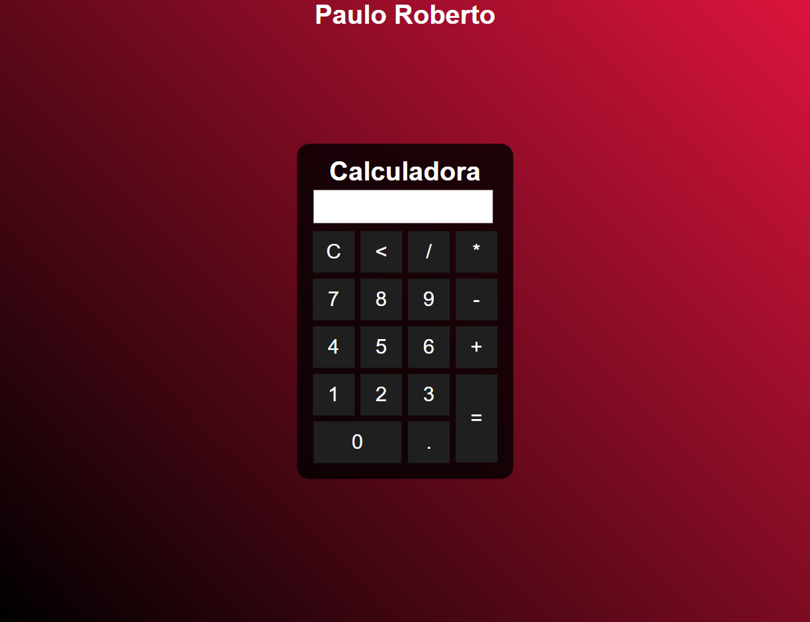

# CALCULADORA

>Criando uma calculadora

## Tecnologias

HTML

CSS

JAVASCRIPT

## O que aprendi

Como configurar o uso da calculadora. Dei inicio ao uso do JavaScript, e comecei a entender a lógica das ferramentas usadas.

## Contato

>email: probertos717@gmail.com